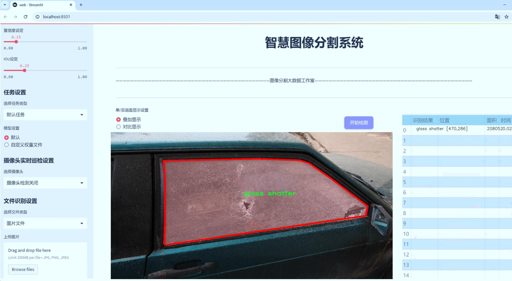
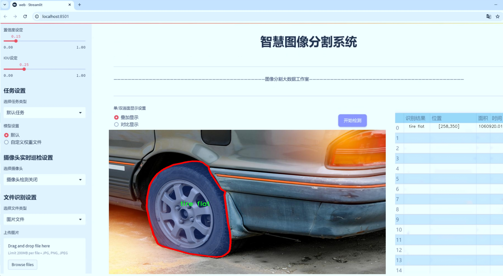
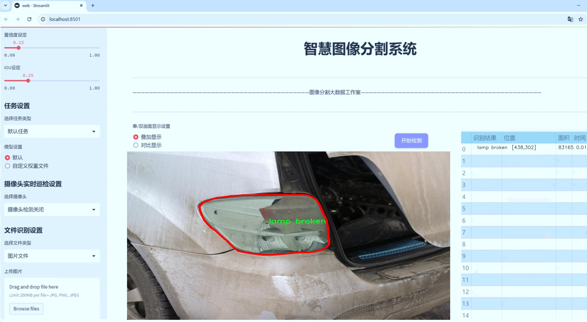
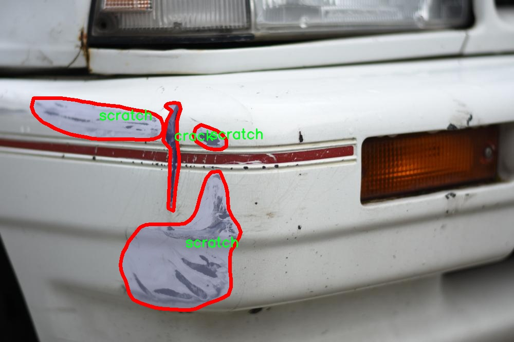
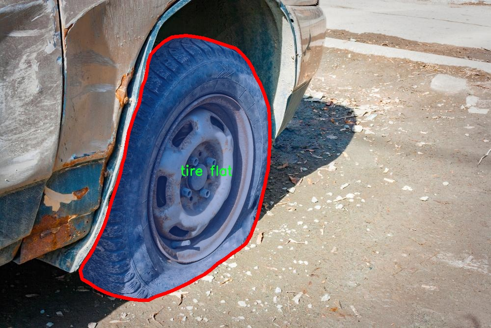
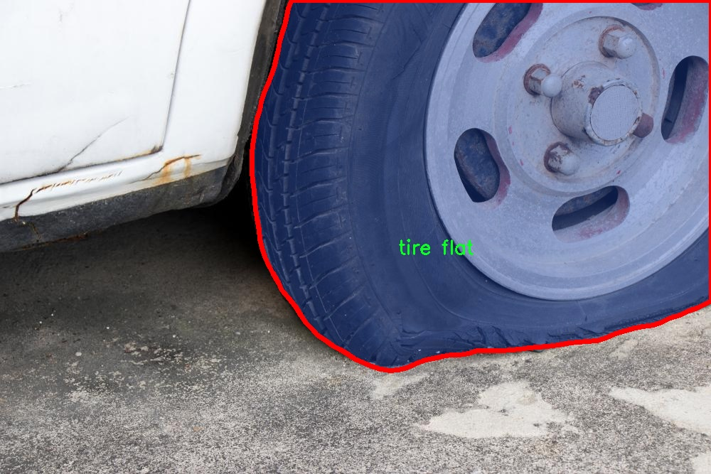
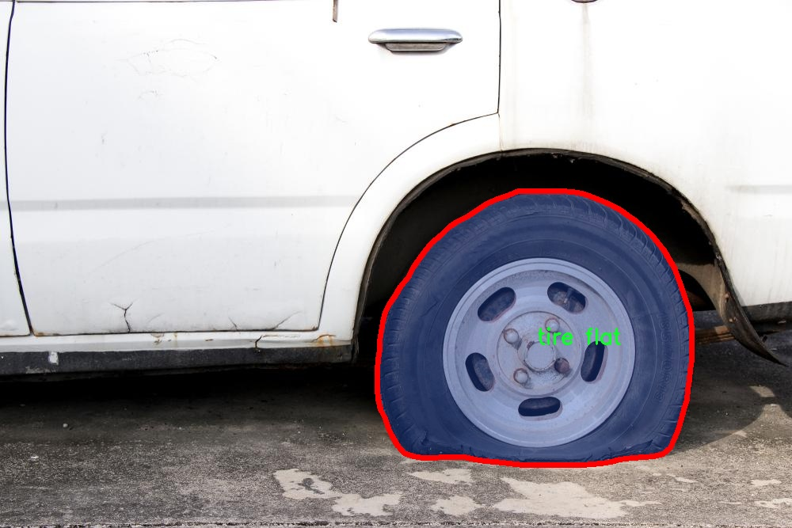
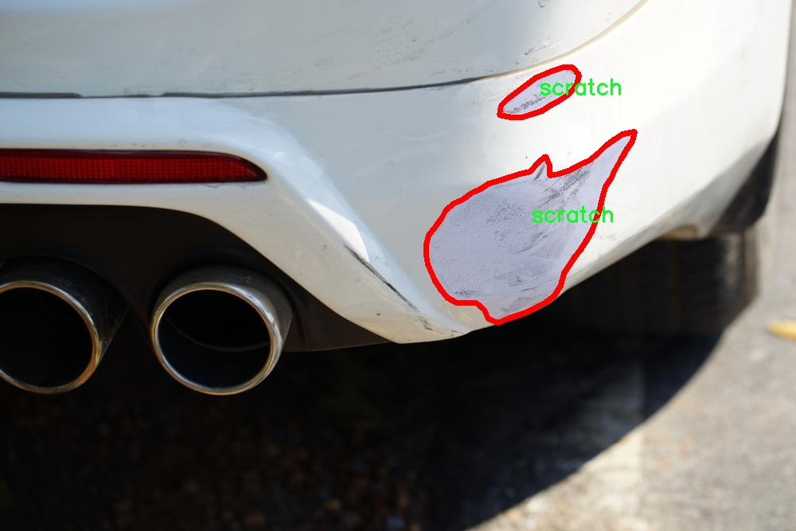

# 汽车损伤爆胎等识别图像分割系统源码＆数据集分享
 [yolov8-seg-C2f-Faster-EMA＆yolov8-seg-act等50+全套改进创新点发刊_一键训练教程_Web前端展示]

### 1.研究背景与意义

项目参考[ILSVRC ImageNet Large Scale Visual Recognition Challenge](https://gitee.com/YOLOv8_YOLOv11_Segmentation_Studio/projects)

项目来源[AAAI Global Al lnnovation Contest](https://kdocs.cn/l/cszuIiCKVNis)

研究背景与意义

随着汽车工业的快速发展，汽车数量的激增导致了交通事故和车辆损伤事件的频繁发生。汽车损伤不仅影响车辆的外观和性能，还可能对驾驶安全造成严重威胁。因此，及时、准确地识别和评估汽车损伤情况，尤其是与爆胎相关的损伤，显得尤为重要。传统的汽车损伤检测方法多依赖于人工检查，效率低下且容易受到主观因素的影响，难以满足现代社会对快速、准确检测的需求。基于此，开发一种高效的汽车损伤识别系统，尤其是针对爆胎等关键损伤的自动化检测技术，具有重要的理论和实际意义。

近年来，深度学习技术的迅猛发展为图像识别和分割领域带来了革命性的变化。YOLO（You Only Look Once）系列模型因其高效的实时检测能力而受到广泛关注。YOLOv8作为该系列的最新版本，结合了多种先进的计算机视觉技术，展现出更强的目标检测和图像分割能力。然而，现有的YOLOv8模型在处理复杂的汽车损伤图像时，仍存在一定的局限性，如对小目标的识别能力不足、对复杂背景的适应性差等。因此，基于改进YOLOv8的汽车损伤识别图像分割系统的研究，不仅能够提升汽车损伤检测的准确性和效率，还能为相关领域的研究提供新的思路和方法。

本研究所使用的数据集包含4000张图像，涵盖了9类汽车损伤，包括裂纹、凹陷、玻璃破碎、灯具损坏、划痕和轮胎爆胎等。这些类别的多样性为模型的训练提供了丰富的样本，有助于提高模型的泛化能力和识别精度。特别是轮胎爆胎这一类损伤，其对行车安全的影响不可忽视，因此，针对这一特定损伤的研究尤为重要。通过对数据集的深入分析和处理，可以提取出有效的特征信息，从而为后续的模型训练奠定坚实的基础。

此外，改进YOLOv8模型的研究不仅具有学术价值，还具备广泛的应用前景。随着智能汽车和自动驾驶技术的发展，汽车损伤检测系统将成为智能交通系统的重要组成部分。通过将改进后的YOLOv8模型应用于实际场景，可以实现对汽车损伤的实时监测和评估，进而提高道路安全性，降低事故发生率。同时，该系统还可以为汽车维修行业提供数据支持，帮助维修人员快速定位损伤部位，提高维修效率。

综上所述，基于改进YOLOv8的汽车损伤爆胎等识别图像分割系统的研究，不仅填补了现有技术在汽车损伤检测领域的空白，还为未来智能交通的发展提供了新的技术支持和理论依据。通过这一研究，期望能够推动汽车安全检测技术的进步，为构建更加安全、高效的交通环境贡献力量。

### 2.图片演示







##### 注意：由于此博客编辑较早，上面“2.图片演示”和“3.视频演示”展示的系统图片或者视频可能为老版本，新版本在老版本的基础上升级如下：（实际效果以升级的新版本为准）

  （1）适配了YOLOV8的“目标检测”模型和“实例分割”模型，通过加载相应的权重（.pt）文件即可自适应加载模型。

  （2）支持“图片识别”、“视频识别”、“摄像头实时识别”三种识别模式。

  （3）支持“图片识别”、“视频识别”、“摄像头实时识别”三种识别结果保存导出，解决手动导出（容易卡顿出现爆内存）存在的问题，识别完自动保存结果并导出到tempDir中。

  （4）支持Web前端系统中的标题、背景图等自定义修改，后面提供修改教程。

  另外本项目提供训练的数据集和训练教程,暂不提供权重文件（best.pt）,需要您按照教程进行训练后实现图片演示和Web前端界面演示的效果。

### 3.视频演示

[3.1 视频演示](https://www.bilibili.com/video/BV1yQyHYXEbj/)

### 4.数据集信息展示

##### 4.1 本项目数据集详细数据（类别数＆类别名）

nc: 6
names: ['crack', 'dent', 'glass shatter', 'lamp broken', 'scratch', 'tire flat']


##### 4.2 本项目数据集信息介绍

数据集信息展示

在本研究中，我们采用了名为“Car damage detection”的数据集，以支持对汽车损伤和爆胎等情况的图像分割系统的训练与改进。该数据集专门设计用于识别和分类汽车表面及部件的各种损伤类型，涵盖了六个主要类别，分别为：裂纹（crack）、凹陷（dent）、玻璃破碎（glass shatter）、灯具损坏（lamp broken）、划痕（scratch）和轮胎漏气（tire flat）。这些类别的选择不仅反映了汽车在日常使用中可能遭遇的常见损伤类型，也为开发更为精准的损伤检测系统提供了基础。

数据集中的每个类别都包含了大量的标注图像，这些图像在不同的光照条件、角度和背景下捕捉了汽车的损伤情况。通过这种多样化的图像采集方式，数据集确保了模型在训练过程中能够学习到丰富的特征，从而提高其在实际应用中的鲁棒性和准确性。例如，裂纹和划痕的图像可能在不同的表面材质上表现出不同的特征，而凹陷和灯具损坏则可能涉及到不同的深度和形状变化。数据集的多样性使得模型能够更好地适应各种实际场景。

在图像标注方面，数据集采用了精确的分割技术，对每个损伤类别进行了细致的标注。这种高质量的标注不仅为模型提供了清晰的学习目标，也为后续的性能评估提供了可靠的基准。通过将损伤区域与背景进行分离，模型能够在进行图像分割时，准确识别出损伤的具体位置和形状。这对于实现自动化的汽车损伤检测系统至关重要，尤其是在需要快速判断和处理的情况下。

此外，数据集的构建还考虑到了不同车型和品牌的多样性，确保了模型在面对不同类型汽车时的适应性。这种广泛的覆盖范围使得训练出的模型能够在多种环境中有效运行，从而提高了其在实际应用中的实用性。例如，轮胎漏气的图像可能来自不同品牌的汽车，而这些汽车的轮胎设计和形状各异，模型在训练过程中学习到的特征将有助于其在不同情况下的表现。

在未来的研究中，我们计划进一步扩展该数据集，增加更多的损伤类型和图像样本，以增强模型的学习能力和泛化能力。同时，我们也将探索数据增强技术，以提高模型在处理真实世界数据时的表现。通过不断优化数据集和模型，我们希望能够开发出一个更加智能和高效的汽车损伤检测系统，为汽车维修行业提供更为精准的技术支持。

综上所述，“Car damage detection”数据集为改进YOLOv8-seg的汽车损伤爆胎等识别图像分割系统提供了坚实的基础，其丰富的类别和高质量的标注将为模型的训练和应用奠定良好的基础。通过对该数据集的深入分析和利用，我们期待能够推动汽车损伤检测技术的发展，为相关领域带来新的突破。











### 5.全套项目环境部署视频教程（零基础手把手教学）

[5.1 环境部署教程链接（零基础手把手教学）](https://www.bilibili.com/video/BV1jG4Ve4E9t/?vd_source=bc9aec86d164b67a7004b996143742dc)


[5.2 安装Python虚拟环境创建和依赖库安装视频教程链接（零基础手把手教学）](https://www.bilibili.com/video/BV1nA4VeYEze/?vd_source=bc9aec86d164b67a7004b996143742dc)

### 6.手把手YOLOV8-seg训练视频教程（零基础小白有手就能学会）

[6.1 手把手YOLOV8-seg训练视频教程（零基础小白有手就能学会）](https://www.bilibili.com/video/BV1cA4VeYETe/?vd_source=bc9aec86d164b67a7004b996143742dc)


按照上面的训练视频教程链接加载项目提供的数据集，运行train.py即可开始训练



     Epoch   gpu_mem       box       obj       cls    labels  img_size
     1/200     0G   0.01576   0.01955  0.007536        22      1280: 100%|██████████| 849/849 [14:42<00:00,  1.04s/it]
               Class     Images     Labels          P          R     mAP@.5 mAP@.5:.95: 100%|██████████| 213/213 [01:14<00:00,  2.87it/s]
                 all       3395      17314      0.994      0.957      0.0957      0.0843

     Epoch   gpu_mem       box       obj       cls    labels  img_size
     2/200     0G   0.01578   0.01923  0.007006        22      1280: 100%|██████████| 849/849 [14:44<00:00,  1.04s/it]
               Class     Images     Labels          P          R     mAP@.5 mAP@.5:.95: 100%|██████████| 213/213 [01:12<00:00,  2.95it/s]
                 all       3395      17314      0.996      0.956      0.0957      0.0845

     Epoch   gpu_mem       box       obj       cls    labels  img_size
     3/200     0G   0.01561    0.0191  0.006895        27      1280: 100%|██████████| 849/849 [10:56<00:00,  1.29it/s]
               Class     Images     Labels          P          R     mAP@.5 mAP@.5:.95: 100%|███████   | 187/213 [00:52<00:00,  4.04it/s]
                 all       3395      17314      0.996      0.957      0.0957      0.0845


### 7.50+种全套YOLOV8-seg创新点代码加载调参视频教程（一键加载写好的改进模型的配置文件）

[7.1 50+种全套YOLOV8-seg创新点代码加载调参视频教程（一键加载写好的改进模型的配置文件）](https://www.bilibili.com/video/BV1Hw4VePEXv/?vd_source=bc9aec86d164b67a7004b996143742dc)

### 8.YOLOV8-seg图像分割算法原理

原始YOLOv8-seg算法原理

YOLOv8-seg算法是YOLO系列中的最新版本，代表了目标检测和实例分割领域的一次重要技术进步。与其前身YOLOv5相比，YOLOv8在检测精度和速度上都实现了显著的提升。该算法不仅适用于目标检测任务，还扩展到了图像分割领域，展示了其在多种计算机视觉任务中的强大能力。YOLOv8的设计理念围绕着实时性、精确性和灵活性展开，适应了不同应用场景的需求。

YOLOv8的网络结构可以分为四个主要部分：输入端、骨干网络、颈部网络和头部网络。输入端负责对输入图像进行预处理，包括马赛克数据增强、自适应锚框计算和自适应灰度填充等操作。这些步骤不仅提高了模型的鲁棒性，还增强了对不同场景和条件下图像的适应能力。马赛克增强通过将多张图像拼接在一起，增加了训练数据的多样性，从而提升了模型的泛化能力。

在骨干网络部分，YOLOv8采用了C2f模块和SPPF（Spatial Pyramid Pooling Fusion）结构。C2f模块的设计灵感来源于YOLOv7的ELAN结构，通过引入更多的分支和跨层连接，显著增强了模型的梯度流动。这种结构使得网络能够更有效地学习和提取特征，从而提高了特征表示能力。SPPF模块则通过不同内核尺寸的池化操作，融合了多尺度特征，进一步丰富了网络的特征信息。

颈部网络采用了路径聚合网络（PAN）结构，这一设计使得YOLOv8在处理不同尺度的目标时，能够更好地融合特征。PAN通过特征金字塔和路径聚合的结合，促进了语义信息和定位信息的有效转移，增强了网络对小目标和大目标的检测能力。这种特征融合策略确保了YOLOv8在多种场景下都能保持高效的检测性能。

头部网络是YOLOv8的另一个重要创新点。在这一部分，YOLOv8将分类和检测过程解耦，采用了主流的解耦头结构。这种设计不仅提高了模型的训练效率，还加速了模型的收敛。YOLOv8的头部网络中，损失计算采用了Task-Aligned Assigner策略，依据分类与回归的分数加权结果选择正样本，从而提升了模型的学习效果。分类分支使用了二元交叉熵损失（BCELoss），而回归分支则结合了分布焦点损失（DFLoss）和完全交并比损失函数（CIOULoss），这两者的结合进一步提升了边界框预测的精准性。

YOLOv8在模型设计上进行了多项创新和优化，特别是在骨干网络和头部网络的结构上进行了重要改进。与YOLOv5的C3结构相比，YOLOv8引入了C2f结构，增强了模型的特征提取能力。此外，YOLOv8还实现了无锚框检测头的设计，减少了锚框预测的数量，进而加速了非最大抑制（NMS）过程。这一改进使得YOLOv8在实时性和精确性之间找到了更好的平衡。

在算法的实际应用中，YOLOv8-seg展示了其在图像分割任务中的强大能力。通过对图像进行像素级的分类，YOLOv8-seg能够精确地分割出目标物体的轮廓，适用于自动驾驶、医学影像分析、视频监控等多个领域。YOLOv8-seg的灵活性和高效性使其成为当前计算机视觉领域中最具竞争力的算法之一。

总的来说，YOLOv8-seg算法通过一系列创新的设计和优化，提升了目标检测和实例分割的性能。其在网络结构、损失函数、特征融合等方面的改进，使得YOLOv8不仅在精度上超越了前代模型，也在速度上实现了优化。这些进步使得YOLOv8-seg在各种实际应用中展现出强大的生命力，成为计算机视觉领域中的一颗璀璨明珠。随着YOLOv8-seg的不断发展和完善，未来的目标检测和图像分割任务将迎来更多的可能性与挑战。


### 9.系统功能展示（检测对象为举例，实际内容以本项目数据集为准）

图9.1.系统支持检测结果表格显示

  图9.2.系统支持置信度和IOU阈值手动调节

  图9.3.系统支持自定义加载权重文件best.pt(需要你通过步骤5中训练获得)

  图9.4.系统支持摄像头实时识别

  图9.5.系统支持图片识别

  图9.6.系统支持视频识别

  图9.7.系统支持识别结果文件自动保存

  图9.8.系统支持Excel导出检测结果数据


### 10.50+种全套YOLOV8-seg创新点原理讲解（非科班也可以轻松写刊发刊，V11版本正在科研待更新）

#### 10.1 由于篇幅限制，每个创新点的具体原理讲解就不一一展开，具体见下列网址中的创新点对应子项目的技术原理博客网址【Blog】：


[10.1 50+种全套YOLOV8-seg创新点原理讲解链接](https://gitee.com/qunmasj/good)

#### 10.2 部分改进模块原理讲解(完整的改进原理见上图和技术博客链接)【如果此小节的图加载失败可以通过CSDN或者Github搜索该博客的标题访问原始博客，原始博客图片显示正常】

### Gold-YOLO简介
YOLO再升级：华为诺亚提出Gold-YOLO，聚集-分发机制打造新SOTA
在过去的几年中，YOLO系列模型已经成为实时目标检测领域的领先方法。许多研究通过修改架构、增加数据和设计新的损失函数，将基线推向了更高的水平。然而以前的模型仍然存在信息融合问题，尽管特征金字塔网络（FPN）和路径聚合网络（PANet）已经在一定程度上缓解了这个问题。因此，本研究提出了一种先进的聚集和分发机制（GD机制），该机制通过卷积和自注意力操作实现。这种新设计的模型被称为Gold-YOLO，它提升了多尺度特征融合能力，在所有模型尺度上实现了延迟和准确性的理想平衡。此外，本文首次在YOLO系列中实现了MAE风格的预训练，使得YOLO系列模型能够从无监督预训练中受益。Gold-YOLO-N在COCO val2017数据集上实现了出色的39.9% AP，并在T4 GPU上实现了1030 FPS，超过了之前的SOTA模型YOLOv6-3.0-N，其FPS相似，但性能提升了2.4%。


#### Gold-YOLO


YOLO系列的中间层结构采用了传统的FPN结构，其中包含多个分支用于多尺度特征融合。然而，它只充分融合来自相邻级别的特征，对于其他层次的信息只能间接地进行“递归”获取。

传统的FPN结构在信息传输过程中存在丢失大量信息的问题。这是因为层之间的信息交互仅限于中间层选择的信息，未被选择的信息在传输过程中被丢弃。这种情况导致某个Level的信息只能充分辅助相邻层，而对其他全局层的帮助较弱。因此，整体上信息融合的有效性可能受到限制。
为了避免在传输过程中丢失信息，本文采用了一种新颖的“聚集和分发”机制（GD），放弃了原始的递归方法。该机制使用一个统一的模块来收集和融合所有Level的信息，并将其分发到不同的Level。通过这种方式，作者不仅避免了传统FPN结构固有的信息丢失问题，还增强了中间层的部分信息融合能力，而且并没有显著增加延迟。


# 8.低阶聚合和分发分支 Low-stage gather-and-distribute branch
从主干网络中选择输出的B2、B3、B4、B5特征进行融合，以获取保留小目标信息的高分辨率特征。


低阶特征对齐模块 (Low-stage feature alignment module)： 在低阶特征对齐模块（Low-FAM）中，采用平均池化（AvgPool）操作对输入特征进行下采样，以实现统一的大小。通过将特征调整为组中最小的特征大小（ R B 4 = 1 / 4 R ） （R_{B4} = 1/4R）（R 
B4 =1/4R），我们得到对齐后的特征F a l i g n F_{align}F align 。低阶特征对齐技术确保了信息的高效聚合，同时通过变换器模块来最小化后续处理的计算复杂性。其中选择 R B 4 R_{B4}R B4 作为特征对齐的目标大小主要基于保留更多的低层信息的同时不会带来较大的计算延迟。
低阶信息融合模块(Low-stage information fusion module)： 低阶信息融合模块（Low-IFM）设计包括多层重新参数化卷积块（RepBlock）和分裂操作。具体而言，RepBlock以F a l i g n ( c h a n n e l = s u m ( C B 2 ， C B 3 ， C B 4 ， C B 5 ) ) F_{align} (channel= sum(C_{B2}，C_{B3}，C_{B4}，C_{B5}))F align (channel=sum(C B2 ，C B3 ，C B4 ，C B5 )作为输入，并生成F f u s e ( c h a n n e l = C B 4 + C B 5 ) F_{fuse} (channel= C_{B4} + C_{B5})F fuse (channel=C B4 +C B5 )。其中中间通道是一个可调整的值（例如256），以适应不同的模型大小。由RepBlock生成的特征随后在通道维度上分裂为F i n j P 3 Finj_P3Finj P 3和F i n j P 4 Finj_P4Finj P 4，然后与不同级别的特征进行融合。


# 8.高阶聚合和分发分支 High-stage gather-and-distribute branch
高级全局特征对齐模块（High-GD）将由低级全局特征对齐模块（Low-GD）生成的特征{P3, P4, P5}进行融合。


高级特征对齐模块(High-stage feature alignment module)： High-FAM由avgpool组成，用于将输入特征的维度减小到统一的尺寸。具体而言，当输入特征的尺寸为{R P 3 R_{P3}R P3 , R P 4 R_{P4}R P4 , R P 5 R_{P 5}R P5 }时，avgpool将特征尺寸减小到该特征组中最小的尺寸（R P 5 R_{P5}R P5  = 1/8R）。由于transformer模块提取了高层次的信息，池化操作有助于信息聚合，同时降低了transformer模块后续步骤的计算需求。

Transformer融合模块由多个堆叠的transformer组成，transformer块的数量为L。每个transformer块包括一个多头注意力块、一个前馈网络（FFN）和残差连接。采用与LeViT相同的设置来配置多头注意力块，使用16个通道作为键K和查询Q的头维度，32个通道作为值V的头维度。为了加速推理过程，将层归一化操作替换为批归一化，并将所有的GELU激活函数替换为ReLU。为了增强变换器块的局部连接，在两个1x1卷积层之间添加了一个深度卷积层。同时，将FFN的扩展因子设置为2，以在速度和计算成本之间取得平衡。

信息注入模块(Information injection module)： 高级全局特征对齐模块（High-GD）中的信息注入模块与低级全局特征对齐模块（Low-GD）中的相同。在高级阶段，局部特征（Flocal）等于Pi，因此公式如下所示：


### 增强的跨层信息流动 Enhanced cross-layer information flow
为了进一步提升性能，从YOLOv8 中的PAFPN模块中得到启发，引入了Inject-LAF模块。该模块是注入模块的增强版，包括了一个轻量级相邻层融合（LAF）模块，该模块被添加到注入模块的输入位置。为了在速度和准确性之间取得平衡，设计了两个LAF模型：LAF低级模型和LAF高级模型，分别用于低级注入（合并相邻两层的特征）和高级注入（合并相邻一层的特征）。它们的结构如图5(b)所示。为了确保来自不同层级的特征图与目标大小对齐，在实现中的两个LAF模型仅使用了三个操作符：双线性插值（上采样过小的特征）、平均池化（下采样过大的特征）和1x1卷积（调整与目标通道不同的特征）。模型中的LAF模块与信息注入模块的结合有效地平衡了准确性和速度之间的关系。通过使用简化的操作，能够增加不同层级之间的信息流路径数量，从而提高性能而不显著增加延迟。


### 11.项目核心源码讲解（再也不用担心看不懂代码逻辑）

#### 11.1 ultralytics\nn\modules\transformer.py

以下是对代码中最核心部分的提取和详细中文注释：

```python
import torch
import torch.nn as nn
import torch.nn.functional as F

class TransformerEncoderLayer(nn.Module):
    """定义单个Transformer编码器层。"""

    def __init__(self, c1, cm=2048, num_heads=8, dropout=0.0, act=nn.GELU(), normalize_before=False):
        """初始化TransformerEncoderLayer，指定参数。"""
        super().__init__()
        self.ma = nn.MultiheadAttention(c1, num_heads, dropout=dropout, batch_first=True)  # 多头自注意力机制
        self.fc1 = nn.Linear(c1, cm)  # 前馈网络的第一层
        self.fc2 = nn.Linear(cm, c1)  # 前馈网络的第二层
        self.norm1 = nn.LayerNorm(c1)  # 第一层归一化
        self.norm2 = nn.LayerNorm(c1)  # 第二层归一化
        self.dropout = nn.Dropout(dropout)  # dropout层
        self.dropout1 = nn.Dropout(dropout)  # dropout层
        self.dropout2 = nn.Dropout(dropout)  # dropout层
        self.act = act  # 激活函数
        self.normalize_before = normalize_before  # 是否在前向传播前进行归一化

    def forward(self, src, src_mask=None, src_key_padding_mask=None, pos=None):
        """通过编码器模块进行前向传播。"""
        if self.normalize_before:
            return self.forward_pre(src, src_mask, src_key_padding_mask, pos)
        return self.forward_post(src, src_mask, src_key_padding_mask, pos)

    def forward_post(self, src, src_mask=None, src_key_padding_mask=None, pos=None):
        """后归一化的前向传播。"""
        q = k = self.with_pos_embed(src, pos)  # 生成查询和键
        src2 = self.ma(q, k, value=src, attn_mask=src_mask, key_padding_mask=src_key_padding_mask)[0]  # 自注意力计算
        src = src + self.dropout1(src2)  # 残差连接
        src = self.norm1(src)  # 归一化
        src2 = self.fc2(self.dropout(self.act(self.fc1(src))))  # 前馈网络
        src = src + self.dropout2(src2)  # 残差连接
        return self.norm2(src)  # 最终归一化

    @staticmethod
    def with_pos_embed(tensor, pos=None):
        """如果提供了位置嵌入，则将其添加到张量中。"""
        return tensor if pos is None else tensor + pos


class DeformableTransformerDecoderLayer(nn.Module):
    """可变形Transformer解码器层。"""

    def __init__(self, d_model=256, n_heads=8, d_ffn=1024, dropout=0., act=nn.ReLU(), n_levels=4, n_points=4):
        """初始化DeformableTransformerDecoderLayer，指定参数。"""
        super().__init__()
        self.self_attn = nn.MultiheadAttention(d_model, n_heads, dropout=dropout)  # 自注意力机制
        self.cross_attn = MSDeformAttn(d_model, n_levels, n_heads, n_points)  # 可变形交叉注意力机制
        self.linear1 = nn.Linear(d_model, d_ffn)  # 前馈网络的第一层
        self.linear2 = nn.Linear(d_ffn, d_model)  # 前馈网络的第二层
        self.act = act  # 激活函数

    def forward(self, embed, refer_bbox, feats, shapes, padding_mask=None, attn_mask=None, query_pos=None):
        """通过整个解码器层进行前向传播。"""
        # 自注意力
        q = k = self.with_pos_embed(embed, query_pos)  # 生成查询和键
        tgt = self.self_attn(q.transpose(0, 1), k.transpose(0, 1), embed.transpose(0, 1), attn_mask=attn_mask)[0].transpose(0, 1)  # 自注意力计算
        embed = embed + tgt  # 残差连接

        # 交叉注意力
        tgt = self.cross_attn(self.with_pos_embed(embed, query_pos), refer_bbox.unsqueeze(2), feats, shapes, padding_mask)  # 可变形交叉注意力计算
        embed = embed + tgt  # 残差连接

        # 前馈网络
        tgt2 = self.linear2(self.act(self.linear1(embed)))  # 前馈网络计算
        return embed + tgt2  # 残差连接

    @staticmethod
    def with_pos_embed(tensor, pos):
        """将位置嵌入添加到输入张量中（如果提供）。"""
        return tensor if pos is None else tensor + pos


class MSDeformAttn(nn.Module):
    """多尺度可变形注意力模块。"""

    def __init__(self, d_model=256, n_levels=4, n_heads=8, n_points=4):
        """初始化MSDeformAttn，指定参数。"""
        super().__init__()
        self.sampling_offsets = nn.Linear(d_model, n_heads * n_levels * n_points * 2)  # 采样偏移量
        self.attention_weights = nn.Linear(d_model, n_heads * n_levels * n_points)  # 注意力权重
        self.value_proj = nn.Linear(d_model, d_model)  # 值的投影
        self.output_proj = nn.Linear(d_model, d_model)  # 输出投影

    def forward(self, query, refer_bbox, value, value_shapes, value_mask=None):
        """进行多尺度可变形注意力的前向传播。"""
        value = self.value_proj(value)  # 值的投影
        sampling_offsets = self.sampling_offsets(query).view(query.shape[0], -1, self.n_heads, self.n_levels, self.n_points, 2)  # 计算采样偏移量
        attention_weights = self.attention_weights(query).view(query.shape[0], -1, self.n_heads, self.n_levels * self.n_points)  # 计算注意力权重
        attention_weights = F.softmax(attention_weights, -1).view(query.shape[0], -1, self.n_heads, self.n_levels, self.n_points)  # 归一化权重
        # 计算采样位置
        # ...（省略具体实现细节）
        output = multi_scale_deformable_attn_pytorch(value, value_shapes, sampling_locations, attention_weights)  # 多尺度可变形注意力计算
        return self.output_proj(output)  # 输出投影
```

### 代码核心部分解释
1. **TransformerEncoderLayer**: 这是Transformer的编码器层，包含多头自注意力机制和前馈网络。支持前后归一化选项。
2. **DeformableTransformerDecoderLayer**: 这是可变形Transformer的解码器层，包含自注意力和交叉注意力机制，支持残差连接和前馈网络。
3. **MSDeformAttn**: 这是多尺度可变形注意力模块，负责处理输入的查询、参考边界框和特征图，计算注意力权重和采样偏移量。

这些模块是构建Transformer模型的基础，适用于各种计算机视觉任务。

这个文件定义了一系列与Transformer相关的模块，主要用于构建深度学习模型，特别是在计算机视觉任务中，如目标检测等。文件中的类和方法主要包括Transformer编码器层、解码器层、注意力机制、前馈网络等。

首先，`TransformerEncoderLayer`类定义了Transformer编码器的单层结构。它使用多头自注意力机制来处理输入数据，并通过前馈神经网络进行进一步的特征提取。该类支持前置和后置归一化的两种前向传播方式，用户可以根据需要选择使用。

`AIFI`类是对`TransformerEncoderLayer`的扩展，增加了二维正弦余弦位置嵌入的功能，以便在处理图像数据时能够更好地捕捉空间信息。其前向传播方法将输入数据进行展平和转置，以适应后续的Transformer处理。

`TransformerLayer`类实现了一个基本的Transformer层，包含自注意力机制和前馈网络。它通过线性变换生成查询、键和值，并将这些输入传递给多头注意力模块。

`TransformerBlock`类则是一个更高层次的模块，结合了卷积层和多个Transformer层。它允许在不同的通道维度上进行特征转换，并通过位置嵌入来增强模型的表达能力。

`MLPBlock`和`MLP`类实现了多层感知机（MLP），前者是一个单独的MLP块，后者则是一个完整的多层感知机，支持多层结构的构建。

`LayerNorm2d`类实现了二维层归一化，用于对输入数据进行归一化处理，以提高模型的训练稳定性和收敛速度。

`MSDeformAttn`类实现了多尺度可变形注意力机制，允许模型在不同尺度上进行特征聚合，适用于处理具有不同分辨率的输入数据。

`DeformableTransformerDecoderLayer`和`DeformableTransformerDecoder`类则实现了可变形Transformer解码器的结构。解码器层通过自注意力和交叉注意力机制来处理输入，并结合前馈网络进行特征提取。解码器模块的设计使得模型能够在目标检测任务中更好地处理边界框和类别信息。

整体来看，这个文件提供了一套完整的Transformer架构实现，适用于各种计算机视觉任务，尤其是在处理图像特征和目标检测时表现出色。每个模块都经过精心设计，以确保在不同的应用场景中能够有效地进行特征提取和信息整合。

#### 11.2 ui.py

以下是代码中最核心的部分，并附上详细的中文注释：

```python
import sys
import subprocess

def run_script(script_path):
    """
    使用当前 Python 环境运行指定的脚本。

    Args:
        script_path (str): 要运行的脚本路径

    Returns:
        None
    """
    # 获取当前 Python 解释器的路径
    python_path = sys.executable

    # 构建运行命令，使用 streamlit 运行指定的脚本
    command = f'"{python_path}" -m streamlit run "{script_path}"'

    # 执行命令，并等待其完成
    result = subprocess.run(command, shell=True)
    
    # 检查命令执行的返回码，如果不为0，表示出错
    if result.returncode != 0:
        print("脚本运行出错。")

# 实例化并运行应用
if __name__ == "__main__":
    # 指定要运行的脚本路径
    script_path = "web.py"  # 假设脚本在当前目录下

    # 调用函数运行脚本
    run_script(script_path)
```

### 代码说明：
1. **导入模块**：
   - `sys`：用于访问与 Python 解释器紧密相关的变量和函数。
   - `subprocess`：用于执行外部命令和程序。

2. **定义 `run_script` 函数**：
   - 该函数接收一个参数 `script_path`，表示要运行的 Python 脚本的路径。
   - 使用 `sys.executable` 获取当前 Python 解释器的路径，以确保使用相同的环境运行脚本。
   - 构建一个命令字符串，使用 `streamlit` 模块运行指定的脚本。
   - 使用 `subprocess.run` 执行命令，并通过 `shell=True` 允许在 shell 中执行命令。
   - 检查命令的返回码，如果返回码不为0，表示脚本运行出错，打印错误信息。

3. **主程序入口**：
   - 使用 `if __name__ == "__main__":` 确保只有在直接运行该脚本时才会执行以下代码。
   - 指定要运行的脚本路径（在这里假设为 `web.py`）。
   - 调用 `run_script` 函数来执行指定的脚本。

这个程序文件名为 `ui.py`，主要功能是通过当前的 Python 环境运行一个指定的脚本，具体是一个名为 `web.py` 的文件。程序首先导入了必要的模块，包括 `sys`、`os` 和 `subprocess`，这些模块分别用于获取系统信息、操作系统功能和执行外部命令。

在 `run_script` 函数中，首先定义了一个参数 `script_path`，它是要运行的脚本的路径。函数内部首先获取当前 Python 解释器的路径，这通过 `sys.executable` 实现。接着，构建一个命令字符串，使用 `streamlit` 来运行指定的脚本。这个命令使用了 Python 的 `-m` 选项，意味着将 `streamlit` 作为一个模块来执行。

随后，使用 `subprocess.run` 方法来执行构建好的命令。该方法的 `shell=True` 参数允许在 shell 中执行命令。如果命令执行后返回的状态码不为零，表示脚本运行出错，程序会打印出相应的错误信息。

在文件的最后部分，使用 `if __name__ == "__main__":` 语句来确保当该文件作为主程序运行时，才会执行以下代码。这里指定了要运行的脚本路径为 `web.py`，并调用 `run_script` 函数来执行该脚本。

整体来看，这个程序的目的是为了方便地通过 Python 环境来启动一个 Streamlit 应用，简化了脚本的运行过程。

#### 11.3 ultralytics\nn\backbone\SwinTransformer.py

以下是简化后的代码，保留了最核心的部分，并添加了详细的中文注释：

```python
import torch
import torch.nn as nn
import torch.nn.functional as F
from timm.models.layers import DropPath, to_2tuple, trunc_normal_

class Mlp(nn.Module):
    """ 多层感知机（MLP）模块 """

    def __init__(self, in_features, hidden_features=None, out_features=None, act_layer=nn.GELU, drop=0.):
        super().__init__()
        out_features = out_features or in_features  # 输出特征数
        hidden_features = hidden_features or in_features  # 隐藏层特征数
        self.fc1 = nn.Linear(in_features, hidden_features)  # 第一层线性变换
        self.act = act_layer()  # 激活函数
        self.fc2 = nn.Linear(hidden_features, out_features)  # 第二层线性变换
        self.drop = nn.Dropout(drop)  # Dropout层

    def forward(self, x):
        """ 前向传播 """
        x = self.fc1(x)  # 线性变换
        x = self.act(x)  # 激活
        x = self.drop(x)  # Dropout
        x = self.fc2(x)  # 线性变换
        x = self.drop(x)  # Dropout
        return x


class WindowAttention(nn.Module):
    """ 基于窗口的多头自注意力模块 """

    def __init__(self, dim, window_size, num_heads, qkv_bias=True, attn_drop=0., proj_drop=0.):
        super().__init__()
        self.dim = dim  # 输入通道数
        self.window_size = window_size  # 窗口大小
        self.num_heads = num_heads  # 注意力头数
        head_dim = dim // num_heads  # 每个头的维度
        self.scale = head_dim ** -0.5  # 缩放因子

        # 定义相对位置偏置参数
        self.relative_position_bias_table = nn.Parameter(
            torch.zeros((2 * window_size[0] - 1) * (2 * window_size[1] - 1), num_heads))

        # 计算相对位置索引
        coords_h = torch.arange(self.window_size[0])
        coords_w = torch.arange(self.window_size[1])
        coords = torch.stack(torch.meshgrid([coords_h, coords_w]))  # 生成网格坐标
        coords_flatten = torch.flatten(coords, 1)  # 展平坐标
        relative_coords = coords_flatten[:, :, None] - coords_flatten[:, None, :]  # 计算相对坐标
        relative_coords = relative_coords.permute(1, 2, 0).contiguous()  # 重新排列
        relative_coords[:, :, 0] += self.window_size[0] - 1  # 偏移
        relative_coords[:, :, 1] += self.window_size[1] - 1
        relative_coords[:, :, 0] *= 2 * self.window_size[1] - 1
        self.relative_position_index = relative_coords.sum(-1)  # 相对位置索引

        self.qkv = nn.Linear(dim, dim * 3, bias=qkv_bias)  # 线性变换生成Q、K、V
        self.attn_drop = nn.Dropout(attn_drop)  # 注意力权重的Dropout
        self.proj = nn.Linear(dim, dim)  # 输出线性变换
        self.proj_drop = nn.Dropout(proj_drop)  # 输出的Dropout

    def forward(self, x, mask=None):
        """ 前向传播 """
        B_, N, C = x.shape  # B: 批量大小, N: 序列长度, C: 特征维度
        qkv = self.qkv(x).reshape(B_, N, 3, self.num_heads, C // self.num_heads).permute(2, 0, 3, 1, 4)
        q, k, v = qkv[0], qkv[1], qkv[2]  # 分离Q、K、V

        q = q * self.scale  # 缩放Q
        attn = (q @ k.transpose(-2, -1))  # 计算注意力权重

        # 添加相对位置偏置
        relative_position_bias = self.relative_position_bias_table[self.relative_position_index.view(-1)].view(
            self.window_size[0] * self.window_size[1], self.window_size[0] * self.window_size[1], -1)
        relative_position_bias = relative_position_bias.permute(2, 0, 1).contiguous()
        attn = attn + relative_position_bias.unsqueeze(0)

        if mask is not None:
            attn = attn + mask.unsqueeze(1).unsqueeze(0)  # 添加mask
        attn = F.softmax(attn, dim=-1)  # 归一化

        attn = self.attn_drop(attn)  # Dropout
        x = (attn @ v).transpose(1, 2).reshape(B_, N, C)  # 计算输出
        x = self.proj(x)  # 输出线性变换
        x = self.proj_drop(x)  # Dropout
        return x


class SwinTransformerBlock(nn.Module):
    """ Swin Transformer模块 """

    def __init__(self, dim, num_heads, window_size=7, shift_size=0, mlp_ratio=4., drop=0., attn_drop=0.):
        super().__init__()
        self.norm1 = nn.LayerNorm(dim)  # 归一化层
        self.attn = WindowAttention(dim, window_size=to_2tuple(window_size), num_heads=num_heads, attn_drop=attn_drop)  # 注意力层
        self.norm2 = nn.LayerNorm(dim)  # 归一化层
        mlp_hidden_dim = int(dim * mlp_ratio)  # MLP隐藏层维度
        self.mlp = Mlp(in_features=dim, hidden_features=mlp_hidden_dim, drop=drop)  # MLP模块

    def forward(self, x):
        """ 前向传播 """
        shortcut = x  # 残差连接
        x = self.norm1(x)  # 归一化
        x = self.attn(x)  # 注意力计算
        x = shortcut + x  # 残差连接
        x = x + self.mlp(self.norm2(x))  # MLP计算
        return x


class SwinTransformer(nn.Module):
    """ Swin Transformer主模型 """

    def __init__(self, embed_dim=96, depths=[2, 2, 6, 2], num_heads=[3, 6, 12, 24], window_size=7):
        super().__init__()
        self.layers = nn.ModuleList()  # 存储各层
        for i in range(len(depths)):
            layer = SwinTransformerBlock(
                dim=int(embed_dim * 2 ** i),
                num_heads=num_heads[i],
                window_size=window_size)
            self.layers.append(layer)  # 添加层

    def forward(self, x):
        """ 前向传播 """
        for layer in self.layers:
            x = layer(x)  # 逐层计算
        return x


def SwinTransformer_Tiny(weights=''):
    """ 创建Swin Transformer Tiny模型 """
    model = SwinTransformer(depths=[2, 2, 6, 2], num_heads=[3, 6, 12, 24])  # 创建模型
    if weights:
        model.load_state_dict(torch.load(weights)['model'])  # 加载权重
    return model
```

### 代码说明：
1. **Mlp类**：实现了一个简单的多层感知机，包含两个线性层和一个激活函数。
2. **WindowAttention类**：实现了窗口自注意力机制，计算输入特征的注意力权重，并考虑相对位置偏置。
3. **SwinTransformerBlock类**：实现了Swin Transformer的基本模块，包含归一化、注意力计算和MLP。
4. **SwinTransformer类**：构建了整个Swin Transformer模型，包含多个Swin Transformer块。
5. **SwinTransformer_Tiny函数**：用于创建一个小型的Swin Transformer模型，并可选择加载预训练权重。

这些核心部分构成了Swin Transformer的基本架构，能够用于图像处理任务。

这个程序文件实现了Swin Transformer模型的核心组件，主要用于计算机视觉任务。Swin Transformer是一种层次化的视觉Transformer，使用了移动窗口的自注意力机制。文件中包含多个类和函数，下面对其进行逐一说明。

首先，导入了必要的库，包括PyTorch的核心模块和一些用于模型构建的工具。接着，定义了一个名为`Mlp`的类，这是一个多层感知机（MLP），用于在Transformer中进行前馈网络的实现。该类的构造函数接受输入特征、隐藏特征、输出特征、激活函数和dropout比率等参数，并在前向传播中实现了线性变换、激活、dropout等操作。

接下来，定义了`window_partition`和`window_reverse`两个函数，分别用于将输入特征分割成窗口和将窗口合并回原始特征。窗口分割的操作是Swin Transformer的关键，它允许模型在局部窗口内进行自注意力计算，从而减少计算复杂度。

`WindowAttention`类实现了基于窗口的多头自注意力机制，支持相对位置偏置。该类的构造函数中定义了相对位置偏置表和查询、键、值的线性变换。前向传播中，输入特征经过线性变换后计算注意力权重，并应用相对位置偏置，最后输出经过投影的特征。

`SwinTransformerBlock`类实现了Swin Transformer的基本模块，包含了归一化、窗口注意力、前馈网络等。它的前向传播方法中，首先对输入进行归一化，然后进行窗口分割、注意力计算和窗口合并，最后通过残差连接和前馈网络得到输出。

`PatchMerging`类用于将特征图中的补丁合并，减少特征图的空间维度。它通过线性变换将4个补丁的特征合并为一个，输出的特征维度加倍。

`BasicLayer`类表示Swin Transformer的一个基本层，包含多个Swin Transformer块和一个可选的下采样层。它的前向传播中计算了注意力掩码，并依次通过每个块进行特征提取。

`PatchEmbed`类用于将输入图像划分为补丁并进行嵌入。它使用卷积层将图像转换为补丁特征，并可选地应用归一化。

最后，`SwinTransformer`类整合了上述所有组件，构建了完整的Swin Transformer模型。它的构造函数中定义了各个层的参数，并在前向传播中处理输入图像，生成补丁特征并通过各个层进行处理，最终输出所需的特征。

此外，文件还定义了一个`update_weight`函数，用于更新模型的权重，并提供了一个`SwinTransformer_Tiny`函数用于创建一个小型的Swin Transformer模型实例，并可选择加载预训练权重。

整体来看，这个文件实现了Swin Transformer的各个模块，能够用于图像分类、目标检测等计算机视觉任务。

#### 11.4 ultralytics\data\build.py

以下是代码中最核心的部分，并附上详细的中文注释：

```python
import os
import random
import numpy as np
import torch
from torch.utils.data import dataloader
from .dataset import YOLODataset  # 导入YOLO数据集类
from .utils import PIN_MEMORY  # 导入内存固定标志

class InfiniteDataLoader(dataloader.DataLoader):
    """
    无限数据加载器，重用工作线程。
    语法与普通DataLoader相同。
    """

    def __init__(self, *args, **kwargs):
        """初始化无限数据加载器，继承自DataLoader。"""
        super().__init__(*args, **kwargs)
        object.__setattr__(self, 'batch_sampler', _RepeatSampler(self.batch_sampler))  # 使用重复采样器
        self.iterator = super().__iter__()  # 初始化迭代器

    def __len__(self):
        """返回批采样器的长度。"""
        return len(self.batch_sampler.sampler)

    def __iter__(self):
        """创建一个无限重复的采样器。"""
        for _ in range(len(self)):
            yield next(self.iterator)  # 迭代返回下一个批次

    def reset(self):
        """
        重置迭代器。
        当我们想在训练过程中修改数据集设置时很有用。
        """
        self.iterator = self._get_iterator()  # 重新获取迭代器

class _RepeatSampler:
    """
    永久重复的采样器。
    Args:
        sampler (Dataset.sampler): 要重复的采样器。
    """

    def __init__(self, sampler):
        """初始化一个对象，使给定的采样器无限重复。"""
        self.sampler = sampler

    def __iter__(self):
        """迭代'sampler'并返回其内容。"""
        while True:
            yield from iter(self.sampler)  # 无限迭代采样器

def seed_worker(worker_id):
    """设置数据加载器工作线程的随机种子。"""
    worker_seed = torch.initial_seed() % 2 ** 32  # 获取当前工作线程的随机种子
    np.random.seed(worker_seed)  # 设置numpy随机种子
    random.seed(worker_seed)  # 设置Python随机种子

def build_yolo_dataset(cfg, img_path, batch, data, mode='train', rect=False, stride=32):
    """构建YOLO数据集。"""
    return YOLODataset(
        img_path=img_path,  # 图像路径
        imgsz=cfg.imgsz,  # 图像大小
        batch_size=batch,  # 批次大小
        augment=mode == 'train',  # 是否进行数据增强
        hyp=cfg,  # 超参数配置
        rect=cfg.rect or rect,  # 是否使用矩形批次
        cache=cfg.cache or None,  # 缓存设置
        single_cls=cfg.single_cls or False,  # 是否单类检测
        stride=int(stride),  # 步幅
        pad=0.0 if mode == 'train' else 0.5,  # 填充
        classes=cfg.classes,  # 类别
        data=data,  # 数据集信息
        fraction=cfg.fraction if mode == 'train' else 1.0  # 训练时的样本比例
    )

def build_dataloader(dataset, batch, workers, shuffle=True, rank=-1):
    """返回用于训练或验证集的InfiniteDataLoader或DataLoader。"""
    batch = min(batch, len(dataset))  # 确保批次大小不超过数据集大小
    nd = torch.cuda.device_count()  # 获取CUDA设备数量
    nw = min([os.cpu_count() // max(nd, 1), batch if batch > 1 else 0, workers])  # 计算工作线程数量
    sampler = None if rank == -1 else distributed.DistributedSampler(dataset, shuffle=shuffle)  # 分布式采样器
    generator = torch.Generator()  # 创建随机数生成器
    generator.manual_seed(6148914691236517205 + RANK)  # 设置随机种子
    return InfiniteDataLoader(dataset=dataset,  # 返回无限数据加载器
                              batch_size=batch,
                              shuffle=shuffle and sampler is None,
                              num_workers=nw,
                              sampler=sampler,
                              pin_memory=PIN_MEMORY,
                              worker_init_fn=seed_worker,  # 设置工作线程的初始化函数
                              generator=generator)  # 设置随机数生成器

def check_source(source):
    """检查源类型并返回相应的标志值。"""
    # 初始化标志
    webcam, screenshot, from_img, in_memory, tensor = False, False, False, False, False
    if isinstance(source, (str, int, Path)):  # 如果源是字符串、整数或路径
        source = str(source)
        is_file = Path(source).suffix[1:] in (IMG_FORMATS + VID_FORMATS)  # 检查是否为文件
        is_url = source.lower().startswith(('https://', 'http://', 'rtsp://', 'rtmp://', 'tcp://'))  # 检查是否为URL
        webcam = source.isnumeric() or source.endswith('.streams') or (is_url and not is_file)  # 检查是否为摄像头
        screenshot = source.lower() == 'screen'  # 检查是否为屏幕截图
    elif isinstance(source, LOADERS):
        in_memory = True  # 如果源是LOADERS类型，则在内存中
    elif isinstance(source, (list, tuple)):
        source = autocast_list(source)  # 将列表元素转换为PIL或numpy数组
        from_img = True
    elif isinstance(source, (Image.Image, np.ndarray)):
        from_img = True  # 如果源是图像或数组
    elif isinstance(source, torch.Tensor):
        tensor = True  # 如果源是张量
    else:
        raise TypeError('不支持的图像类型。')

    return source, webcam, screenshot, from_img, in_memory, tensor  # 返回源及其类型标志

def load_inference_source(source=None, imgsz=640, vid_stride=1, buffer=False):
    """
    加载用于目标检测的推理源并应用必要的变换。
    Args:
        source: 输入源，可以是路径、张量、图像等。
        imgsz: 推理图像的大小，默认为640。
        vid_stride: 视频源的帧间隔，默认为1。
        buffer: 是否缓冲流帧，默认为False。
    Returns:
        dataset: 针对指定输入源的数据集对象。
    """
    source, webcam, screenshot, from_img, in_memory, tensor = check_source(source)  # 检查源类型
    # 根据源类型加载相应的数据集
    if tensor:
        dataset = LoadTensor(source)  # 加载张量
    elif in_memory:
        dataset = source  # 使用内存中的数据
    elif webcam:
        dataset = LoadStreams(source, imgsz=imgsz, vid_stride=vid_stride, buffer=buffer)  # 加载摄像头流
    elif screenshot:
        dataset = LoadScreenshots(source, imgsz=imgsz)  # 加载屏幕截图
    elif from_img:
        dataset = LoadPilAndNumpy(source, imgsz=imgsz)  # 加载PIL或numpy图像
    else:
        dataset = LoadImages(source, imgsz=imgsz, vid_stride=vid_stride)  # 加载图像文件

    setattr(dataset, 'source_type', source_type)  # 将源类型附加到数据集

    return dataset  # 返回数据集对象
```

以上代码是YOLO模型数据加载和处理的核心部分，包含了数据加载器的实现、数据集的构建以及源类型的检查和加载。

这个程序文件是用于构建和管理YOLO（You Only Look Once）模型的数据加载器，主要涉及到数据集的构建、数据加载以及源的检查等功能。首先，程序导入了一些必要的库，包括操作系统相关的库、随机数生成库、路径处理库、NumPy、PyTorch、PIL图像处理库等。

在程序中定义了一个名为`InfiniteDataLoader`的类，它继承自PyTorch的`DataLoader`，这个类的主要功能是创建一个可以无限循环的迭代器，方便在训练过程中重复使用数据加载的工作。`InfiniteDataLoader`类重写了`__len__`和`__iter__`方法，使得它可以在训练时不断返回数据。

接着，定义了一个名为`_RepeatSampler`的内部类，它的作用是实现一个可以无限重复的采样器。这个采样器会不断迭代给定的采样器，确保数据可以被重复使用。

`seed_worker`函数用于设置数据加载器的工作线程的随机种子，以确保每次运行时的随机性一致性。

`build_yolo_dataset`函数用于构建YOLO数据集。它接收多个参数，包括配置、图像路径、批量大小等，并返回一个`YOLODataset`对象。这个函数会根据训练模式决定是否进行数据增强，并设置其他与数据集相关的参数。

`build_dataloader`函数则用于返回一个`InfiniteDataLoader`或普通的`DataLoader`，用于训练或验证集。它会根据可用的CUDA设备数量和工作线程数量来设置数据加载的参数，并支持分布式训练。

`check_source`函数用于检查输入源的类型，并返回相应的标志值。它支持多种输入类型，包括文件路径、URL、图像、视频流等，确保输入源可以被正确处理。

最后，`load_inference_source`函数用于加载推理源，适用于目标检测任务。它会根据输入源的类型选择合适的数据加载方式，并返回一个数据集对象。这个函数也会对输入源进行必要的转换，以确保其适用于YOLO模型的推理。

整体来看，这个程序文件提供了一套完整的数据加载和处理机制，旨在为YOLO模型的训练和推理提供高效、灵活的数据支持。

#### 11.5 ultralytics\nn\backbone\VanillaNet.py

以下是代码中最核心的部分，并附上详细的中文注释：

```python
import torch
import torch.nn as nn
import torch.nn.functional as F
from timm.layers import weight_init

# 定义激活函数类
class activation(nn.ReLU):
    def __init__(self, dim, act_num=3, deploy=False):
        super(activation, self).__init__()
        self.deploy = deploy  # 是否处于部署模式
        # 初始化权重和偏置
        self.weight = torch.nn.Parameter(torch.randn(dim, 1, act_num*2 + 1, act_num*2 + 1))
        self.bias = None
        self.bn = nn.BatchNorm2d(dim, eps=1e-6)  # 批归一化
        self.dim = dim
        self.act_num = act_num
        weight_init.trunc_normal_(self.weight, std=.02)  # 权重初始化

    def forward(self, x):
        # 前向传播
        if self.deploy:
            return torch.nn.functional.conv2d(
                super(activation, self).forward(x), 
                self.weight, self.bias, padding=(self.act_num*2 + 1)//2, groups=self.dim)
        else:
            return self.bn(torch.nn.functional.conv2d(
                super(activation, self).forward(x),
                self.weight, padding=self.act_num, groups=self.dim))

    def switch_to_deploy(self):
        # 切换到部署模式
        if not self.deploy:
            kernel, bias = self._fuse_bn_tensor(self.weight, self.bn)  # 融合权重和偏置
            self.weight.data = kernel
            self.bias = torch.nn.Parameter(torch.zeros(self.dim))
            self.bias.data = bias
            self.__delattr__('bn')  # 删除bn属性
            self.deploy = True

# 定义网络块
class Block(nn.Module):
    def __init__(self, dim, dim_out, act_num=3, stride=2, deploy=False):
        super().__init__()
        self.deploy = deploy
        # 根据是否部署选择不同的卷积层
        if self.deploy:
            self.conv = nn.Conv2d(dim, dim_out, kernel_size=1)
        else:
            self.conv1 = nn.Sequential(
                nn.Conv2d(dim, dim, kernel_size=1),
                nn.BatchNorm2d(dim, eps=1e-6),
            )
            self.conv2 = nn.Sequential(
                nn.Conv2d(dim, dim_out, kernel_size=1),
                nn.BatchNorm2d(dim_out, eps=1e-6)
            )
        # 池化层
        self.pool = nn.MaxPool2d(stride) if stride != 1 else nn.Identity()
        self.act = activation(dim_out, act_num)  # 激活函数

    def forward(self, x):
        # 前向传播
        if self.deploy:
            x = self.conv(x)
        else:
            x = self.conv1(x)
            x = F.leaky_relu(x, negative_slope=0.1)  # 使用Leaky ReLU激活
            x = self.conv2(x)

        x = self.pool(x)  # 池化
        x = self.act(x)  # 激活
        return x

# 定义主网络结构
class VanillaNet(nn.Module):
    def __init__(self, in_chans=3, num_classes=1000, dims=[96, 192, 384, 768], 
                 drop_rate=0, act_num=3, strides=[2,2,2,1], deploy=False):
        super().__init__()
        self.deploy = deploy
        # 初始化网络的stem部分
        if self.deploy:
            self.stem = nn.Sequential(
                nn.Conv2d(in_chans, dims[0], kernel_size=4, stride=4),
                activation(dims[0], act_num)
            )
        else:
            self.stem1 = nn.Sequential(
                nn.Conv2d(in_chans, dims[0], kernel_size=4, stride=4),
                nn.BatchNorm2d(dims[0], eps=1e-6),
            )
            self.stem2 = nn.Sequential(
                nn.Conv2d(dims[0], dims[0], kernel_size=1, stride=1),
                nn.BatchNorm2d(dims[0], eps=1e-6),
                activation(dims[0], act_num)
            )

        self.stages = nn.ModuleList()  # 存储网络的各个阶段
        for i in range(len(strides)):
            stage = Block(dim=dims[i], dim_out=dims[i+1], act_num=act_num, stride=strides[i], deploy=deploy)
            self.stages.append(stage)

    def forward(self, x):
        # 前向传播
        if self.deploy:
            x = self.stem(x)
        else:
            x = self.stem1(x)
            x = F.leaky_relu(x, negative_slope=0.1)
            x = self.stem2(x)

        for stage in self.stages:
            x = stage(x)  # 通过每个阶段
        return x

# 示例用法
if __name__ == '__main__':
    inputs = torch.randn((1, 3, 640, 640))  # 输入张量
    model = VanillaNet()  # 创建模型
    pred = model(inputs)  # 进行预测
    print(pred.size())  # 输出预测结果的尺寸
```

### 代码说明：
1. **激活函数类**：定义了一个自定义的激活函数类，支持在训练和部署模式下的不同操作。
2. **Block类**：表示网络中的一个基本块，包含卷积层、批归一化和激活函数。
3. **VanillaNet类**：定义了整个网络结构，包括输入层（stem）和多个Block的组合。
4. **前向传播**：在每个类中实现了`forward`方法，负责数据的流动和处理。
5. **示例用法**：在主程序中创建了一个输入张量，并通过模型进行预测，最后输出预测结果的尺寸。

这个程序文件实现了一个名为 `VanillaNet` 的深度学习模型，主要用于图像处理任务。文件中包含了多个类和函数，下面是对代码的详细说明。

首先，文件引入了必要的库，包括 `torch` 和 `torch.nn`，这些是 PyTorch 框架的核心库，用于构建和训练神经网络。还引入了 `timm.layers` 中的 `weight_init` 和 `DropPath`，以及 `numpy` 库。

接下来，定义了一个名为 `activation` 的类，继承自 `nn.ReLU`。这个类实现了一种自定义的激活函数，包含了可学习的权重和偏置。它在前向传播中使用卷积操作，并根据 `deploy` 参数选择不同的计算方式。`switch_to_deploy` 方法用于将模型切换到推理模式，融合批归一化层的参数。

然后，定义了一个 `Block` 类，表示网络中的一个基本模块。该模块包含两个卷积层和一个激活函数，支持可选的自适应池化。`forward` 方法实现了模块的前向传播，`switch_to_deploy` 方法则用于将模块切换到推理模式。

接下来是 `VanillaNet` 类，它是整个网络的核心。构造函数中根据输入通道数、类别数、维度和步幅等参数初始化网络结构。网络的第一部分是一个stem层，后面是多个 `Block` 模块，构成了网络的主干。`forward` 方法实现了整个网络的前向传播，返回不同尺度的特征图。

文件中还定义了 `_init_weights` 方法，用于初始化网络权重，`change_act` 方法用于修改激活函数的学习率。

接下来，定义了一些函数用于创建不同版本的 `VanillaNet` 模型（如 `vanillanet_5` 到 `vanillanet_13_x1_5_ada_pool`），这些函数允许用户加载预训练权重。

最后，在 `__main__` 块中，创建了一个输入张量并实例化了 `vanillanet_10` 模型，随后进行了前向传播并打印输出特征图的尺寸。

总体来说，这个文件实现了一个灵活且可扩展的卷积神经网络结构，适用于各种图像处理任务，并提供了预训练模型的加载功能。

#### 11.6 ultralytics\models\yolo\detect\__init__.py

以下是代码中最核心的部分，并附上详细的中文注释：

```python
# 导入必要的模块
from .predict import DetectionPredictor  # 导入检测预测器类
from .train import DetectionTrainer      # 导入检测训练器类
from .val import DetectionValidator      # 导入检测验证器类

# 定义模块的公开接口，指定可以被外部访问的类
__all__ = 'DetectionPredictor', 'DetectionTrainer', 'DetectionValidator'
```

### 注释说明：
1. **导入模块**：
   - `from .predict import DetectionPredictor`：从当前包的 `predict` 模块中导入 `DetectionPredictor` 类，该类负责进行目标检测的预测。
   - `from .train import DetectionTrainer`：从当前包的 `train` 模块中导入 `DetectionTrainer` 类，该类用于训练目标检测模型。
   - `from .val import DetectionValidator`：从当前包的 `val` 模块中导入 `DetectionValidator` 类，该类用于验证目标检测模型的性能。

2. **定义公开接口**：
   - `__all__` 是一个特殊的变量，用于定义当使用 `from module import *` 语句时，哪些名称是可以被导入的。在这里，只有 `DetectionPredictor`、`DetectionTrainer` 和 `DetectionValidator` 这三个类可以被外部访问。这样做可以控制模块的公共 API，避免不必要的名称冲突。

这个程序文件是Ultralytics YOLO模型的一部分，主要用于目标检测。文件的开头包含了一条注释，说明了该项目的名称“Ultralytics YOLO”以及其使用的许可证类型（AGPL-3.0）。接下来，文件通过相对导入的方式引入了三个主要的类：`DetectionPredictor`、`DetectionTrainer`和`DetectionValidator`。这些类分别负责目标检测的不同阶段：预测、训练和验证。

`DetectionPredictor`类通常用于在给定图像上进行目标检测，输出检测结果；`DetectionTrainer`类则用于训练YOLO模型，调整模型参数以提高检测精度；而`DetectionValidator`类则用于验证模型的性能，评估其在测试集上的表现。

最后，`__all__`变量定义了模块的公共接口，指定了在使用`from module import *`时，哪些类会被导入。这种做法有助于清晰地管理模块的公共API，使得用户能够方便地使用这些核心功能。整体来看，这个文件的结构简洁明了，主要功能是将不同的检测相关类组织在一起，方便其他模块进行调用。

### 12.系统整体结构（节选）

### 整体功能和构架概括

该项目是一个基于Ultralytics YOLO（You Only Look Once）目标检测框架的实现，结合了多种深度学习模型和数据处理工具。整体架构包括多个模块，分别负责模型的构建、训练、验证、数据加载和处理等功能。以下是各个模块的主要功能：

- **模型模块**：实现了不同类型的神经网络架构，如Swin Transformer、VanillaNet等，提供了特征提取和目标检测的能力。
- **数据处理模块**：负责数据集的构建、加载和转换，确保模型训练和推理时能够高效地获取数据。
- **检测模块**：实现了YOLO模型的训练、验证和预测功能，支持目标检测任务。
- **用户界面模块**：提供了一个简单的界面来运行模型和进行推理。
- **工具模块**：包含一些辅助功能，如回调函数、模型转换等，增强了框架的灵活性和可扩展性。

### 文件功能整理表

| 文件路径                                           | 功能描述                                                         |
|---------------------------------------------------|------------------------------------------------------------------|
| `ultralytics/nn/modules/transformer.py`          | 实现Transformer相关模块，包括编码器、解码器和注意力机制等。     |
| `ui.py`                                          | 提供一个用户界面，通过Streamlit运行指定的脚本。                   |
| `ultralytics/nn/backbone/SwinTransformer.py`    | 实现Swin Transformer模型的各个组件，适用于计算机视觉任务。       |
| `ultralytics/data/build.py`                      | 构建YOLO数据集，提供数据加载和源检查功能。                       |
| `ultralytics/nn/backbone/VanillaNet.py`         | 实现VanillaNet模型，提供图像处理能力，支持多种激活函数和模块。   |
| `ultralytics/models/yolo/detect/__init__.py`    | 组织YOLO检测相关的类，包含预测、训练和验证功能。                 |
| `ultralytics/utils/atss.py`                      | 实现ATSS（Adaptive Training Sample Selection）算法，优化训练样本选择。 |
| `train.py`                                       | 训练YOLO模型的主程序，包含训练循环和参数调整。                   |
| `ultralytics/nn/backbone/CSwomTransformer.py`   | 实现CSwim Transformer模型，结合了卷积和自注意力机制。             |
| `ultralytics/utils/callbacks/raytune.py`        | 实现与Ray Tune集成的回调函数，用于超参数调优。                   |
| `ultralytics/data/converter.py`                  | 数据转换工具，支持将数据集转换为YOLO格式。                       |
| `ultralytics/models/yolo/pose/__init__.py`      | 组织YOLO姿态估计相关的类和功能。                                 |
| `ultralytics/models/sam/model.py`                | 实现SAM（Segment Anything Model）模型，支持图像分割任务。       |

这个表格概述了每个文件的主要功能，帮助理解整个项目的结构和功能模块。

注意：由于此博客编辑较早，上面“11.项目核心源码讲解（再也不用担心看不懂代码逻辑）”中部分代码可能会优化升级，仅供参考学习，完整“训练源码”、“Web前端界面”和“50+种创新点源码”以“14.完整训练+Web前端界面+50+种创新点源码、数据集获取”的内容为准。

### 13.图片、视频、摄像头图像分割Demo(去除WebUI)代码

在这个博客小节中，我们将讨论如何在不使用WebUI的情况下，实现图像分割模型的使用。本项目代码已经优化整合，方便用户将分割功能嵌入自己的项目中。
核心功能包括图片、视频、摄像头图像的分割，ROI区域的轮廓提取、类别分类、周长计算、面积计算、圆度计算以及颜色提取等。
这些功能提供了良好的二次开发基础。

### 核心代码解读

以下是主要代码片段，我们会为每一块代码进行详细的批注解释：

```python
import random
import cv2
import numpy as np
from PIL import ImageFont, ImageDraw, Image
from hashlib import md5
from model import Web_Detector
from chinese_name_list import Label_list

# 根据名称生成颜色
def generate_color_based_on_name(name):
    ......

# 计算多边形面积
def calculate_polygon_area(points):
    return cv2.contourArea(points.astype(np.float32))

...
# 绘制中文标签
def draw_with_chinese(image, text, position, font_size=20, color=(255, 0, 0)):
    image_pil = Image.fromarray(cv2.cvtColor(image, cv2.COLOR_BGR2RGB))
    draw = ImageDraw.Draw(image_pil)
    font = ImageFont.truetype("simsun.ttc", font_size, encoding="unic")
    draw.text(position, text, font=font, fill=color)
    return cv2.cvtColor(np.array(image_pil), cv2.COLOR_RGB2BGR)

# 动态调整参数
def adjust_parameter(image_size, base_size=1000):
    max_size = max(image_size)
    return max_size / base_size

# 绘制检测结果
def draw_detections(image, info, alpha=0.2):
    name, bbox, conf, cls_id, mask = info['class_name'], info['bbox'], info['score'], info['class_id'], info['mask']
    adjust_param = adjust_parameter(image.shape[:2])
    spacing = int(20 * adjust_param)

    if mask is None:
        x1, y1, x2, y2 = bbox
        aim_frame_area = (x2 - x1) * (y2 - y1)
        cv2.rectangle(image, (x1, y1), (x2, y2), color=(0, 0, 255), thickness=int(3 * adjust_param))
        image = draw_with_chinese(image, name, (x1, y1 - int(30 * adjust_param)), font_size=int(35 * adjust_param))
        y_offset = int(50 * adjust_param)  # 类别名称上方绘制，其下方留出空间
    else:
        mask_points = np.concatenate(mask)
        aim_frame_area = calculate_polygon_area(mask_points)
        mask_color = generate_color_based_on_name(name)
        try:
            overlay = image.copy()
            cv2.fillPoly(overlay, [mask_points.astype(np.int32)], mask_color)
            image = cv2.addWeighted(overlay, 0.3, image, 0.7, 0)
            cv2.drawContours(image, [mask_points.astype(np.int32)], -1, (0, 0, 255), thickness=int(8 * adjust_param))

            # 计算面积、周长、圆度
            area = cv2.contourArea(mask_points.astype(np.int32))
            perimeter = cv2.arcLength(mask_points.astype(np.int32), True)
            ......

            # 计算色彩
            mask = np.zeros(image.shape[:2], dtype=np.uint8)
            cv2.drawContours(mask, [mask_points.astype(np.int32)], -1, 255, -1)
            color_points = cv2.findNonZero(mask)
            ......

            # 绘制类别名称
            x, y = np.min(mask_points, axis=0).astype(int)
            image = draw_with_chinese(image, name, (x, y - int(30 * adjust_param)), font_size=int(35 * adjust_param))
            y_offset = int(50 * adjust_param)

            # 绘制面积、周长、圆度和色彩值
            metrics = [("Area", area), ("Perimeter", perimeter), ("Circularity", circularity), ("Color", color_str)]
            for idx, (metric_name, metric_value) in enumerate(metrics):
                ......

    return image, aim_frame_area

# 处理每帧图像
def process_frame(model, image):
    pre_img = model.preprocess(image)
    pred = model.predict(pre_img)
    det = pred[0] if det is not None and len(det)
    if det:
        det_info = model.postprocess(pred)
        for info in det_info:
            image, _ = draw_detections(image, info)
    return image

if __name__ == "__main__":
    cls_name = Label_list
    model = Web_Detector()
    model.load_model("./weights/yolov8s-seg.pt")

    # 摄像头实时处理
    cap = cv2.VideoCapture(0)
    while cap.isOpened():
        ret, frame = cap.read()
        if not ret:
            break
        ......

    # 图片处理
    image_path = './icon/OIP.jpg'
    image = cv2.imread(image_path)
    if image is not None:
        processed_image = process_frame(model, image)
        ......

    # 视频处理
    video_path = ''  # 输入视频的路径
    cap = cv2.VideoCapture(video_path)
    while cap.isOpened():
        ret, frame = cap.read()
        ......
```


### 14.完整训练+Web前端界面+50+种创新点源码、数据集获取


# [下载链接：https://mbd.pub/o/bread/Zp2bk5hr](https://mbd.pub/o/bread/Zp2bk5hr)